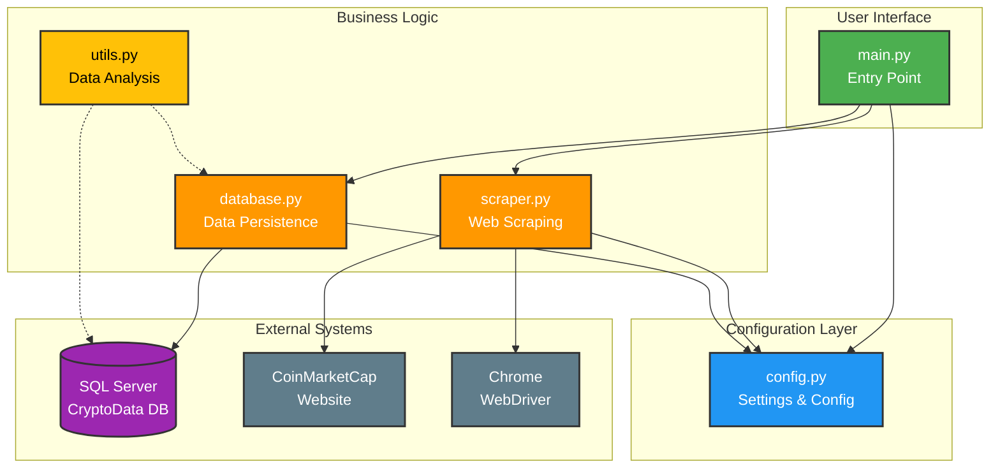
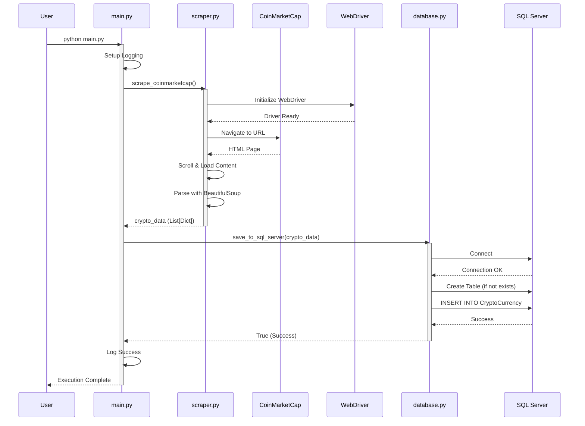
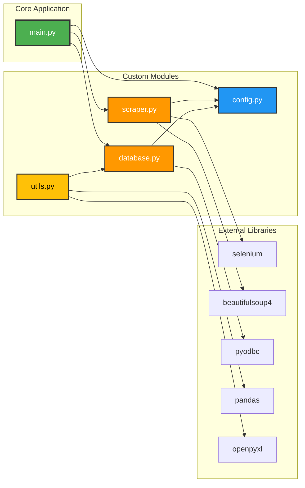
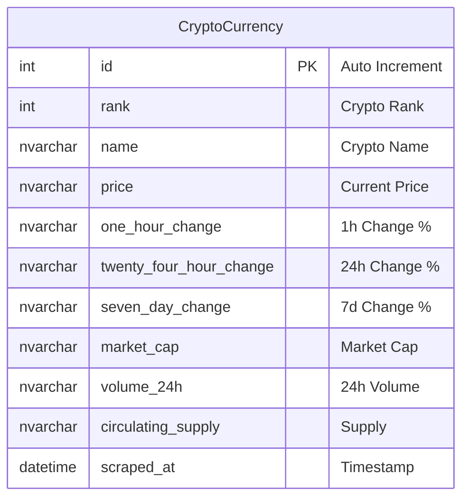
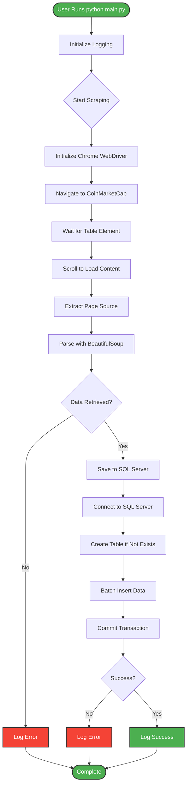

<!-- 
  CoinMarketCap Scraper - Architecture Diagram for Draw.io
  
  HOW TO USE:
  1. Go to https://app.diagrams.net/ (Draw.io)
  2. Click "File" > "Import from" > "Device"
  3. Select this file (architecture_diagram.drawio)
  4. Edit and customize as needed
  
  OR you can copy the Mermaid diagram below and use it in:
  - GitHub Markdown
  - Mermaid Live Editor (https://mermaid.live/)
  - VS Code with Mermaid extension
-->

# MERMAID DIAGRAM - SYSTEM ARCHITECTURE



---

# MERMAID DIAGRAM - DATA FLOW



---

# MERMAID DIAGRAM - MODULE DEPENDENCIES



---

# MERMAID DIAGRAM - DATABASE SCHEMA



---

# MERMAID DIAGRAM - EXECUTION FLOW



---

# SIMPLE TEXT DIAGRAM FOR QUICK REFERENCE

```
PROJECT STRUCTURE:

coinmarketcap-scraper/
│
├── main.py              ← Entry point (orchestrates everything)
│   ├── calls scraper.py
│   └── calls database.py
│
├── scraper.py           ← Web scraping logic
│   ├── Uses: Selenium + BeautifulSoup
│   └── Returns: List[Dict] of crypto data
│
├── database.py          ← SQL Server operations
│   ├── Uses: pyodbc
│   └── Stores data in SQL Server
│
├── config.py            ← Configuration settings
│   ├── DB_CONFIG
│   ├── SCRAPING settings
│   └── CHROME_OPTIONS
│
├── utils.py             ← Optional utilities
│   ├── Export to CSV/Excel
│   └── Data analysis functions
│
└── requirements.txt     ← Python dependencies
```

---

# INSTRUCTIONS FOR DRAW.IO

To create this diagram in Draw.io:

1. **Open Draw.io**: Go to https://app.diagrams.net/

2. **Create Basic Shapes**:
   - Use "Rectangle" for modules
   - Use "Cylinder" for databases
   - Use "Cloud" for external services
   - Use "Arrows" for data flow

3. **Color Coding**:
   - Green: Entry points (main.py)
   - Blue: Configuration (config.py)
   - Orange: Business Logic (scraper.py, database.py)
   - Yellow: Utilities (utils.py)
   - Purple: Databases
   - Grey: External services

4. **Layout Suggestions**:
   - Top-Down flow for execution
   - Left-Right flow for dependencies
   - Grouped boxes for related components

5. **Export Options**:
   - PNG for documentation
   - SVG for web
   - PDF for presentations

---

# ONLINE DIAGRAM TOOLS

You can use these Mermaid diagrams directly in:

1. **Mermaid Live Editor**: https://mermaid.live/
   - Copy any Mermaid code block above
   - Paste and edit
   - Export as PNG/SVG

2. **Draw.io**: https://app.diagrams.net/
   - Import this file or create manually

3. **GitHub**: 
   - Mermaid is natively supported in GitHub markdown

4. **VS Code**:
   - Install "Markdown Preview Mermaid Support" extension
   - View diagrams in markdown preview
